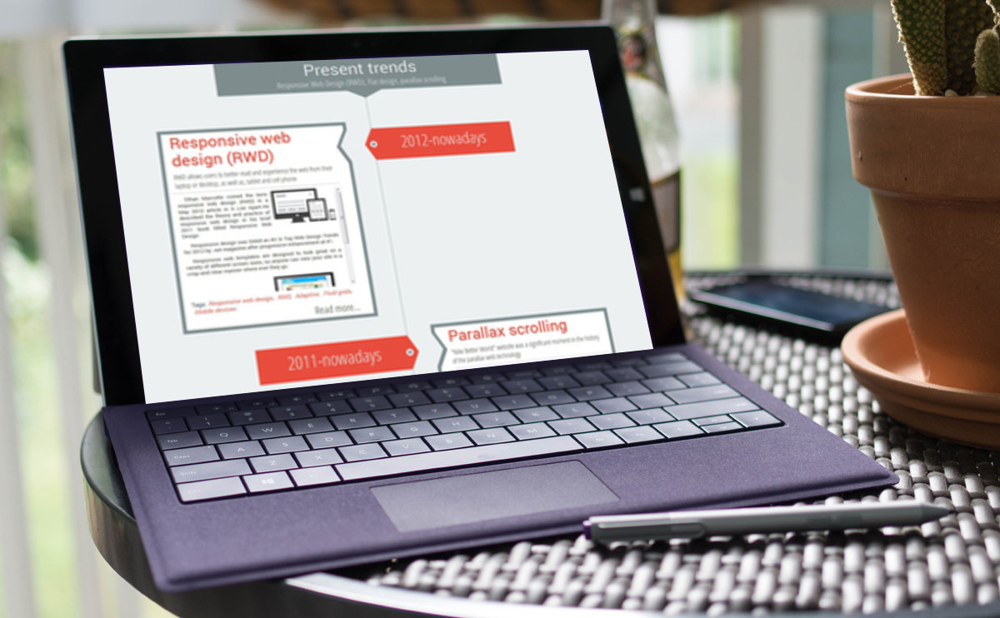

Vertical responsive timeline on pure css
======
In this experiment we'll create a vertical responsive timeline.
###### Powered by html5, css3 and less css.
###### Compatible Browsers: IE9+, Firefox, Chrome, Opera, Safari, Yandex.browser


License
---
[MIT](http://opensource.org/licenses/MIT)

Demo
------
You can see live demo here: [http://orlovmax.com/lab/vertical-responsive-timeline](http://orlovmax.com/lab/vertical-responsive-timeline "vertical responsive timeline live demo")

Please note
---
In reset.css most of elements `box-sizing` sets to `border-box`. 


Basic markup
------
```html
<section class="timeline">
	<div class="timeline_milestone">						
		<h2 class="milestone_title"></h2><!--Milestone title-->
		<p class="milestone_meta"></p><!--Milestone meta information or annotation-->
	</div>
	<article class="timeline_post">
		<h1 class="tl-post_date"></h1><!--Date, that will be shown in colored label-->
		<div class="tl-post_card">
			<header class="tl-post_header">
				<h2 class="tl-post_title"></h2><!--Post title-->
				<p class="tl-post_meta"></p><!--Post meta or resume-->
			</header>
			<div class="tl-post_content">
				<div class="content_wrap">
					<!--post image-->						
					<p class="tl-post_text">Post text</p><!--Post paragraph-->
				</div>
			</div>
			<div class="tl-post_footer">
				<p class="tl-post_tags">Tags:
					<span>Some tag</span>
					<span>Another tag</span>
				</p><!--Post related tags-->
				<a class="tl-post_readmore" href="" title="">Read more...</a><!--Link to related full article or original source-->	
			</div>
		</div>
	</article>
</section>		
```

Basic styles
------
```css
.timeline {
  position: relative;
  max-width: 1200px;/* timeline width, feel free to set desired width in px or percents */
  margin: 0 auto;
  padding: 0 10px;
  overflow: hidden;
  text-align: center;
  clear: both;
}		
	.timeline:before {}	/*dotted line across all timeline from top to bottom*/
	.timeline_milestone {
	  position: relative;
	  width: 70%;
	  min-height: 100px;
	  margin: 0 auto 100px;
	  padding: 10px;
	  background-color: #7f8c8d;
	}			
		.timeline_milestone:after {} /*bottom arrow of milestone block*/			
		.milestone_title {} /*some properties of milestone title*/			
		.milestone_meta {} /*some properties of milestone annotation*/		
		
	.timeline_post { /*timeline row, that contain date label and post*/
	  display: block;
	  position: relative;
	  width: 100%;
	  margin: 40px 0;
	  clear: both;
	}		
		.timeline_post:before,
		.timeline_post:after {} /*clearfix to prevent collapsing parents of floated elements*/		 			
		.timeline_post:before {} /*center positioned bullet in each row*/		
		
		.tl-post_date { /*label-arrow with date*/
		  position: relative;
		  width: 35%;
		  min-height: 100px;
		  margin-top: 25px;
		  padding: 15px 0;
		  background-color: #e74c3c;
		  font-size: 50px;
		  color: #ecf0f1;
		}				
		.tl-post_card { /*card with main content*/
		  position: relative;
		  width: 42%;
		  min-height: 200px;
		  border-top: 10px solid #7f8c8d;
		  border-bottom: 10px solid #7f8c8d;
		  background-color: #ffffff;
		  text-align: left;
		}
			.tl-post_header { /*header with title and annotation*/
			  position: relative;
			  min-height: 125px;
			  padding-bottom: 10px;
			  border-bottom: 1px dashed #7f8c8d;
			  background-color: #ffffff;
			}			
				.tl-post_title {} /*some  properties of post title*/				
				.tl-post_meta {} /*some properties of post annotation*/	
				
			.tl-post_content {
			  position: relative;
			  background-color: #ffffff;
			  text-align: center;
			}
				.tl-post_content:after {	} /*clearfix to prevent collapsing content block*/
				.content_wrap {
				  min-height: 100px;
				  max-height: 300px;
				  padding: 0 10px;
				  overflow-y: auto;
				}
					.tl-post_text {} /*some properties of post paragraph*/
					
					.tl-post_image { /*ordinary full-width image*/
					  display: inline-block;
					  max-width: 90%;
					}
					.tl-post_image.left { /*floated left image*/
					  float: left;
					  max-width: 40%;
					  margin-right: 10px;
					}
					.tl-post_image.right { /*floated right image*/
					  float: right;
					  max-width: 40%;
					  margin-left: 10px;
					}
			.tl-post_footer { /*footer with tags and readmore-link*/
			  position: relative;
			  min-height: 50px;
			  padding-bottom: 10px;
			  background-color: #ffffff;
			  font-family: "Roboto", sans-serif;
			}
				.tl-post_tags {} /*some properties of post tags*/
					.tl-post_tags span {}
						.tl-post_tags span:not(:last-of-type):after { /*commas between tags*/
						  content: ",";
						}
				.tl-post_readmore {} /*readmore link properties*/
```
There is a bunch of code for pseudo-elements and all those arrows and angles, so if you want see more, check markup and styles sections in [this tutorial](http://orlovmax.com/lab/vertical-responsive-timeline "vertical responsive timeline live demo")

Screenshots
---
**You can see more screenshots [here](screenshots/)**



---

Product mockup created with [http://frame.lab25.co.uk/](http://frame.lab25.co.uk/)